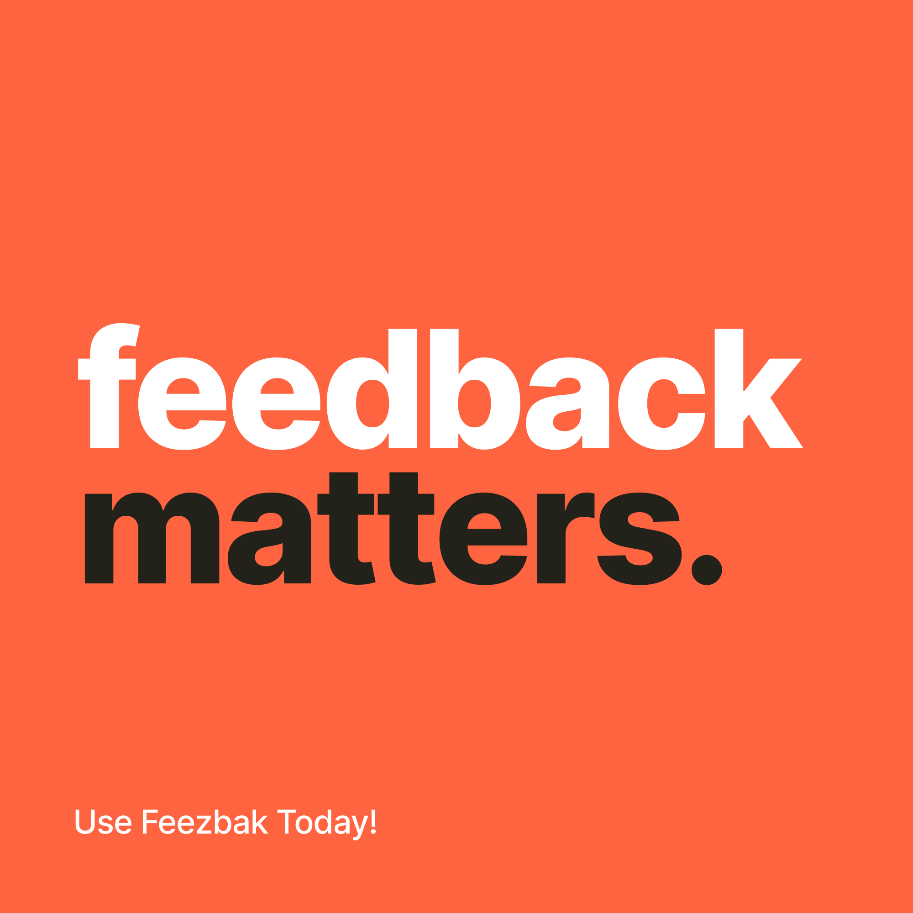

<h1 align="center">Welcome to Feezbak 👋</h1>

<p>
  
  <a href="https://github.com/Feezbak/feezbak-web#readme" target="_blank">
    
  </a>
  <a href="https://github.com/Feezbak/feezbak-web/graphs/commit-activity" target="_blank">
    
  </a>
  <a href="https://twitter.com/tarokavardanyan" target="_blank">
    
  </a>
</p>

> A feedback accumulation application is a powerful tool that streamlines the process of collecting and managing feedback from various sources. It serves as a central hub where users can easily submit their feedback, suggestions, or bug reports, providing a convenient and structured way to gather insights and address user needs.

The application allows users to submit feedback through various channels, such as web forms, in-app widgets, or integrations with communication platforms like email or chat. It supports different types of feedback, including text-based messages, ratings, surveys, or even file attachments, to capture a wide range of user input.

Once feedback is submitted, the application organizes and categorizes it for efficient analysis. It may include features such as tagging, labeling, or categorization to help classify feedback based on different criteria, such as product areas, feature requests, or severity levels. Additionally, it can provide capabilities for prioritizing, assigning, or tracking the status of each feedback item to ensure proper handling and follow-up.

Feedback accumulation applications often include collaboration features to facilitate communication and collaboration among team members. This can involve commenting, thread discussions, and notifications to keep stakeholders informed about progress, updates, or resolutions related to specific feedback items. It promotes transparency, collaboration, and accountability within the team.

Advanced reporting and analytics features are also typically included in a feedback accumulation application. It provides insights into feedback trends, sentiment analysis, and quantitative metrics, enabling data-driven decision-making. These insights help identify patterns, prioritize improvements, and guide product roadmap decisions based on user needs and expectations.

Overall, a feedback accumulation application empowers businesses and organizations to actively engage with their users, collect valuable feedback, and effectively manage the feedback lifecycle. By leveraging this application, companies can improve their products, enhance user satisfaction, and foster a customer-centric approach to continuous improvement and innovation.

### 🏠 [Homepage](https://github.com/Feezbak/feezbak-web#readme)

### ✨ [Demo](https://web-feezbak.mixbox.am/)

## Docker

To use a Docker image for your project during development, you'll need to follow these general steps:

1. Install Docker: If you haven't already, install Docker on your development machine. Docker provides installation instructions for various operating systems on their website.
2. Pull the Docker image from Docker Hub or private repositories. Use the docker pull command to download the image you want to use. For example:

```sh
docker pull taronvardanyan/feezbak-web:latest
```
3. Create a container: Use the docker run command to create and start a container based on the image you pulled.

```sh
docker run -it -p 8080:80 -v /path/to/local/code:/app taronvardanyan/feezbak-web:latest
```
4. Access the container: Once the container starts, you can access it using a shell or terminal inside the container. Run the following command to access a shell:

```sh
docker exec -it feezbak-web /bin/bash
```

5. Develop inside the container: Now that you're inside the container, you can navigate to the appropriate directory and start developing your project. You should have access to all the dependencies and tools installed in the Docker image.

## Install

```sh
yarn install
```

## Usage

```sh
yarn run start
```

## Run tests

```sh
yarn run test
```

## Author

👤 **Taron Vardanyan**

* Twitter: [@tarokavardanyan](https://twitter.com/tarokavardanyan)
* Github: [@TaronVardanyan](https://github.com/TaronVardanyan)
* LinkedIn: [@Taron Vardanyan](https://www.linkedin.com/in/taron-vardanyan-3a1b85198)
